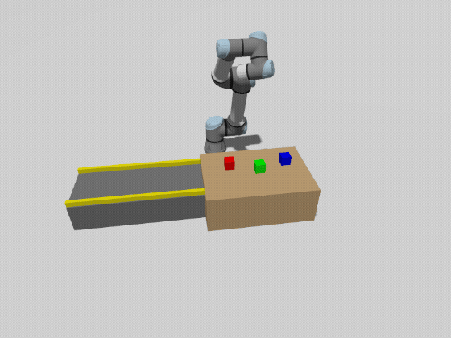
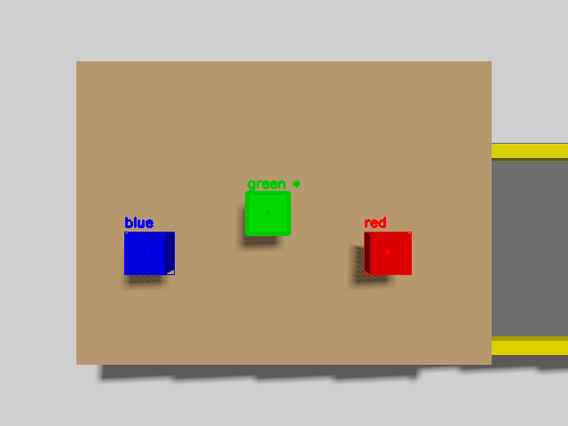

# moveit-ur5-pick-place

Vision-guided, collision-aware pick-and-place for a simulated Universal Robots
UR5e using MoveIt 2 and ROS 2 Jazzy, framed as an industrial colour-sorting cell:
three coloured parts sit on a table, an operator selects a colour, and the arm
picks that part and places it on a conveyor belt.

This is the sequel to my from-scratch kinematics work in
[robot-arm-ik](https://github.com/MKamel7/robot-arm-ik). There I wrote forward
kinematics, inverse kinematics, and trajectory generation by hand. Here I drive
the production motion-planning framework that industry actually deploys (MoveIt 2
with OMPL) and add a perception front-end so the grasp target comes from a camera
rather than a hardcoded pose.



*The operator selects a colour; the UR5e picks that part and places it on the
conveyor, which carries it away from the table.*



*The downward RGB-D camera segments the three parts; the operator-selected colour
(green here) is marked with a thicker box and used as the pick target. The
conveyor belt with yellow rails is on the right.*

## What it does

1. Brings up a UR5e in Gazebo (gz-sim Harmonic) with MoveIt 2 and ros2_control.
2. Views a source table with an overhead RGB-D camera and segments the red,
   green, and blue parts by HSV colour (classical, no GPU needed on this machine).
3. Lifts the selected part's 2D detection to a 3D pose in the robot base frame
   using the depth image and the camera-to-base transform.
4. Plans and executes a collision-aware, top-down grasp with OMPL (RRTConnect),
   attaches the part, and places it on the conveyor belt.

## Architecture

Reusable, ROS-independent logic lives in `ur5_pick_place/` and is unit tested
without a running robot:

- `perception.py`: pinhole de-projection, quaternion/Euler transforms, and the
  camera-optical-frame transform. `pixel_to_base` turns a pixel plus a depth
  reading into a 3D point in the base frame.
- `segmentation.py`: HSV colour presets (red/green/blue) and largest-blob
  segmentation plus robust depth sampling.
- `grasp.py`: top-down grasp-pose generation with pre-grasp and retreat
  stand-offs along the approach axis.
- `metrics.py`: joint/cartesian path-length metrics and a segment-vs-box test
  used to quantify obstacle avoidance.

The ROS nodes wire these into MoveIt and Gazebo:

- `detector_node.py`: subscribes to the RGB-D camera, detects the parts, and
  publishes the selected colour's pose on `/detected_object_pose`.
- `pick_place_node.py`: `moveit_py` node that takes the perceived pick pose,
  builds the planning scene (table, belt, part), and runs the pick-and-place.
- `obstacle_demo.py`: the collision-aware planning demonstration.

Data flow:

```
RGB-D camera (gz) --ros_gz_bridge--> /rgbd_camera/{image,depth_image,camera_info}
      -> detector_node (HSV segment + depth + camera_optical_transform)
      -> /detected_object_pose  -> pick_place_node (moveit_py + OMPL) -> UR5e
```

## Build

Requires ROS 2 Jazzy with MoveIt 2, the Universal Robots packages, and
`ur_simulation_gz`.

```bash
cd moveit-ur5-pick-place
source /opt/ros/jazzy/setup.bash
colcon build --symlink-install
source install/setup.bash
```

## Run

One command brings up the world (robot, table, three parts, conveyor, camera),
MoveIt, the camera bridge, and the detector. Choose the target colour:

```bash
ros2 launch ur5_pick_place demo_bringup.launch.py target_color:=green   # or red, blue
```

Then run the perception-driven pick-and-place:

```bash
ros2 launch ur5_pick_place pick_place.launch.py
```

The collision-avoidance demonstration (independent of perception):

```bash
ros2 launch ur5_pick_place obstacle_demo.launch.py
```

RViz is off by default because Gazebo and RViz together overwhelm this machine's
integrated GPU; planning runs in `move_group` regardless.

## Test

```bash
cd src/ur5_pick_place
python3 -m pytest test/ -q
```

40 unit tests cover the perception-to-pose geometry, grasp planning, colour
segmentation and depth sampling, and the path-length metrics. CI
(`.github/workflows/ci.yml`) lints with ruff, runs these tests on a plain
runner, and separately builds the package and runs `colcon test` in a ROS 2
Jazzy container.

## Measured results

All numbers are from my own runs in simulation.

- **Perception accuracy**: with the green part at a true position of
  (0.55, 0.17) m on the table, the detector recovered
  (0.551, 0.171) m in x, y (1-2 mm error), and z at the object's top surface
  (0.250 m), which is the correct grasp height.
- **Collision-aware planning**: for a lateral end-effector move blocked by a
  thin wall, OMPL routed around it. Baseline plan (no wall): 0.025 s, 1.581 rad
  joint-space path. Around the wall: 0.086 s, 6.435 rad (a 4.07x longer joint
  path), executed collision-free. A tested segment-vs-box check confirms the
  naive straight-line move would have passed through the wall.
- **Pick-and-place**: the full perception-driven sequence (ready, pre-grasp,
  grasp, lift, transfer, place, retreat) planned and executed with the trajectory
  controller reporting SUCCEEDED at every step, placing the selected part on the
  conveyor.

## Honest limitations

- No physical gripper is modelled, and gz-sim's default dartsim engine does not
  build the UR mesh collisions, so a friction grasp is not simulated. The grasp
  is handled at the MoveIt planning-scene level (attach/detach), and the part is
  moved kinematically to follow the tool frame during the carry and to ride the
  conveyor afterwards (see `part_animator.py`). The arm motion, the perception,
  and the collision-aware planning are all real; the grasp itself is kinematic
  rather than force-based.
- A randomized multi-trial success-rate evaluation (parts at random positions)
  is not yet automated, so I do not quote an aggregate success rate here.
- Screen-captured Gazebo/RViz video is not included because the machine runs a
  Wayland session where the available capture tools grab a blank frame from the
  native Gazebo window; the evidence here is the detector's own rendered camera
  frames and the run logs.

See `BUILD_LOG.md` for the full development journal.

## One-line summary for a CV

Built a vision-guided UR5e pick-and-place in ROS 2 Jazzy and MoveIt 2: an RGB-D
camera and classical colour segmentation localise a selected part to a 3D grasp
pose (1-2 mm accuracy in sim), then OMPL plans a collision-aware, obstacle-avoiding
top-down grasp that places it on a conveyor, with a unit-tested perception core
and CI.

## License

MIT. See `LICENSE`.
