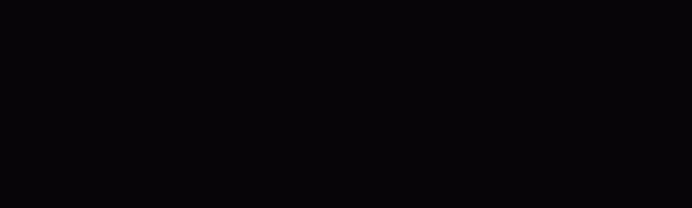

# Vision-Guided Pick & Place

Vision-guided, collision-aware pick-and-place for a simulated Universal Robots
UR5e with MoveIt 2 on ROS 2 Jazzy, framed as an industrial colour-sorting cell.
An overhead RGB-D camera segments three coloured parts by HSV, the selected one
is lifted to a 3D pose in the robot base frame from the depth image, and OMPL
plans a collision-aware top-down grasp onto a moving conveyor.

This is the sequel to writing forward kinematics, inverse kinematics and
trajectories by hand in
[robot-arm-ik](https://github.com/MKamel7/robot-arm-ik): here the framework
industry actually deploys does the planning, and the grasp target comes from a
camera rather than a hardcoded pose. The cell is validated against the real UR
driver with URSim, and exposes itself to a PLC through an OPC UA server and a
live cell dashboard.



*Four views at once: what the camera sees, the Gazebo digital shadow, the real
UR teach pendant, and live process telemetry. 40 s, played at 4.5x so three
cycles and a safety event fit. Everything in it is real; nothing is cut.*
[Full-quality video (mp4)](https://github.com/MKamel7/moveit-ur5-pick-place/releases/latest).

| | |
| --- | --- |
| **3** | colours segmented from RGB-D, operator picks one |
| **40** | unit tests on ROS-independent logic, run in CI |
| **URSim** | validated against the real UR driver over RTDE |

ROS 2 Jazzy · MoveIt 2 · OMPL · Gazebo Harmonic · RGB-D perception · OPC UA

## What it does

1. Brings up a UR5e with a Robotiq 2F-85 in Gazebo (gz-sim Harmonic) with
   MoveIt 2 and ros2_control.
2. Views a source bin with an overhead RGB-D camera and segments the red, green
   and blue parts by HSV colour, with a saturation term so shadows and grey
   surfaces cannot be read as parts. Classical CV, no GPU required.
3. Lifts the selected part's 2D detection to a 3D pose in the robot base frame
   using the depth image and the camera-to-base transform.
4. Plans and executes a collision-aware, top-down grasp with OMPL (RRTConnect),
   attaches the part, and sorts it to one of three outfeed lanes, one per
   colour, fanned out radially at 0, 35 and 70 degrees on a 0.62 m arc.
5. Supervises the whole thing with a functional-safety layer and publishes
   process telemetry over OPC UA to a live dashboard.

## Architecture

Reusable, ROS-independent logic lives in `src/ur5_pick_place/` and is unit
tested without a running robot:

- `perception.py`: pinhole de-projection, quaternion/Euler transforms and the
  camera-optical-frame transform. `pixel_to_base` turns a pixel plus a depth
  reading into a 3D point in the base frame.
- `segmentation.py`: HSV colour presets (red/green/blue, red as two ranges for
  hue wrap) and largest-blob segmentation plus robust depth sampling.
- `grasp.py`: top-down grasp-pose generation with pre-grasp and retreat
  stand-offs along the approach axis.
- `metrics.py`: joint/cartesian path-length metrics and a segment-vs-box test
  used to quantify obstacle avoidance.

The ROS nodes in `src/armik_moveit/` wire these into MoveIt, Gazebo and the
fieldbus:

- `detector.py`: subscribes to the RGB-D camera, detects the parts and
  publishes the selected colour's pose.
- `color_sort.py`: takes the perceived pick pose, builds the planning scene and
  runs the pick-and-place to the matching outfeed lane.
- `safety_supervisor.py`: latched e-stop, guard interlock, speed and separation
  monitoring per ISO/TS 15066, watchdog.
- `opcua_server.py` / `dashboard.py`: the fieldbus interface and the live
  control-room HMI.
- `gz_twin.py` / `twin_world.py`: the Gazebo digital shadow, generated at launch
  from the same description that drives ros2_control and MoveIt.

Data flow:

```
RGB-D camera (gz) --ros_gz_bridge--> /rgbd_camera/{image,depth_image,camera_info}
      -> detector (HSV segment + depth + camera_optical_transform)
      -> /detected_object_pose -> color_sort (moveit_py + OMPL) -> UR5e
                                      |
      /joint_states -> robot_state_publisher -> TF -> gz_twin -> Gazebo poses
                                      |
                              /cell/telemetry -> opcua_server + dashboard
```

## Build

Requires ROS 2 Jazzy with MoveIt 2, the Universal Robots packages and
`ur_simulation_gz`.

```bash
cd moveit-ur5-pick-place
source /opt/ros/jazzy/setup.bash
colcon build --symlink-install
source install/setup.bash
```

## Run

The full sorting cell with the digital shadow:

```bash
ros2 launch armik_moveit sort_cell_twin.launch.py gui:=true
```

The perception-driven pick-and-place on the earlier single-conveyor world:

```bash
ros2 launch ur5_pick_place demo_bringup.launch.py target_color:=green  # or red, blue
ros2 launch ur5_pick_place pick_place.launch.py
```

The collision-avoidance demonstration (independent of perception):

```bash
ros2 launch ur5_pick_place obstacle_demo.launch.py
```

Against a real arm or URSim, instead of mock hardware:

```bash
ros2 launch armik_moveit ur5e_gripper_moveit.launch.py \
    use_mock_hardware:=false robot_ip:=<arm ip> use_mock_gripper:=true
```

RViz is off by default in the Gazebo launches because Gazebo and RViz together
overwhelm this machine's integrated GPU; planning runs in `move_group`
regardless.

## Test

```bash
cd src/ur5_pick_place
python3 -m pytest test/ -q
```

40 unit tests cover the perception-to-pose geometry, grasp planning, colour
segmentation and depth sampling, and the path-length metrics. CI
(`.github/workflows/ci.yml`) lints with ruff, runs these tests on a plain
runner, and separately builds the packages and runs `colcon test` in a ROS 2
Jazzy container. `tools/test_twin_mirror.py` and `tools/test_twin_grasp.py`
check the digital shadow against TF and check that a carried part holds a fixed
offset in the gripper frame.

## Measured results

All numbers are from my own runs.

- **Perception accuracy**: with the green part at a true position of
  (0.55, 0.17) m, the detector recovered (0.551, 0.171) m in x, y (1-2 mm
  error), and z at the object's top surface (0.250 m), the correct grasp height.
- **Digital shadow**: 0.019 mm and 0.68 mrad agreement with TF when stationary
  over 450 comparisons, and about 13 ms of transport delay while moving,
  measured against URSim over RTDE.
- **Collision-aware planning**: for a lateral end-effector move blocked by a
  thin wall, OMPL routed around it. Baseline plan (no wall): 0.025 s, 1.581 rad
  joint-space path. Around the wall: 0.086 s, 6.435 rad (a 4.07x longer joint
  path), executed collision-free. A tested segment-vs-box check confirms the
  naive straight-line move would have passed through the wall.
- **Pick-and-place**: the full perception-driven sequence (ready, pre-grasp,
  grasp, lift, transfer, place, retreat) planned and executed with the
  trajectory controller reporting SUCCEEDED at every step.

## Honest scope

Validated **hardware in the loop** against URSim, which runs the same URControl
software and RTDE interface as a physical UR5e. This is not sim to real:

- The perception is simulated (Gazebo RGB-D, no real camera or parts), the
  Robotiq gripper is mocked, and there is no physical robot.
- The Gazebo view is one way, physical to digital, so it is a digital shadow
  rather than a full twin.
- There is no camera calibration: the camera pose is known by construction in
  simulation. Hand-eye calibration is listed in `ros2_docs/HARDWARE.md` as a
  prerequisite for real hardware.
- The dashboard reports throughput, cycle time and counts. Those are process
  metrics, not an OEE figure.
- A randomised multi-trial success-rate evaluation is not automated, so no
  aggregate success rate is quoted here.

Further documentation: `ros2_docs/SAFETY.md` for the functional-safety layer,
`ros2_docs/HARDWARE.md` for running against a real arm, and
`ros2_docs/DEMO_VIDEO.md` for how the four-panel video is captured and rendered.

## License

MIT. See `LICENSE`.
